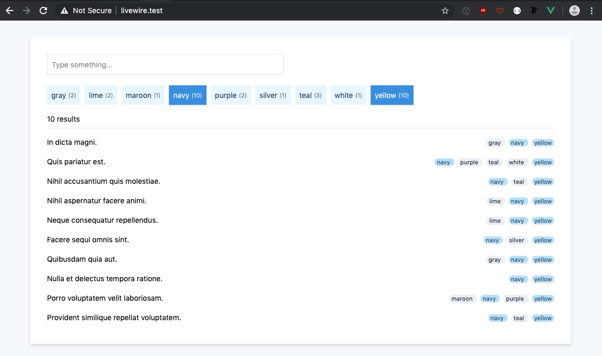
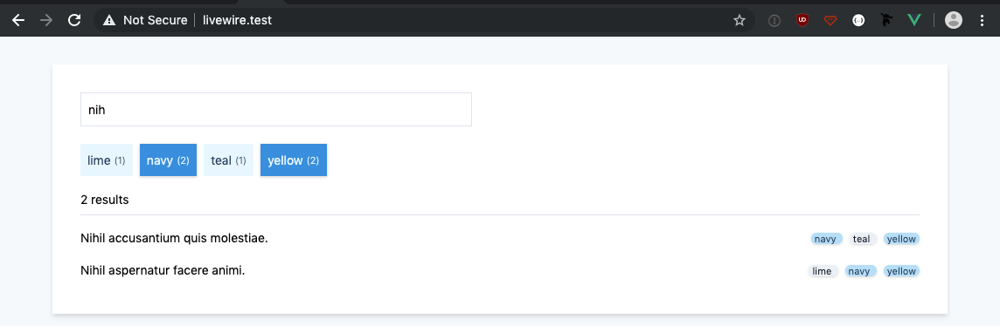

# Laravel Livewire Demo

## Description

A small demo of realtime keyword searching and multi-facet filtering on a dataset tagged with a random assortment of tags. All done with [Livewire](https://livewire-framework.com/), no JS required.

### All records


### Filter by multiple tags



### Filter by multiple tags and search string



### Inline/in place editing


## Installation

Clone, `composer install`, `yarn install`, configure `.env` and your DB connection.

Migrate and seed the DB.

```bash
php artisan migrate --seed
```
